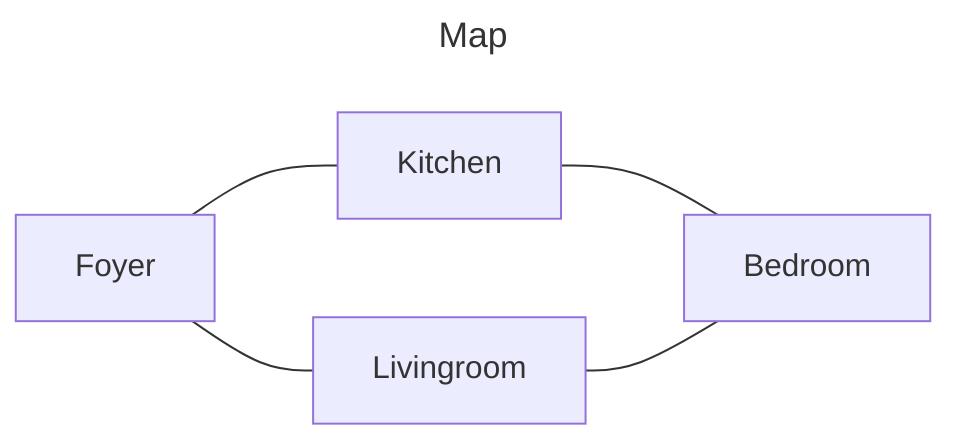

# About me

- 🌱 I’m currently learning Markdown

| Rank | THING-TO-RANK |
|-----:|---------------|
|     1| Peace         |
|     2| Calm          |
|     3| Quiet         |

<details>
  <summary>Thins to look out for</summary>
  Every summer has but one day that defines it.
  It is the day we only know once it has ended.
</details>

```C
void foo() {
  print("Stuff");
}
```


